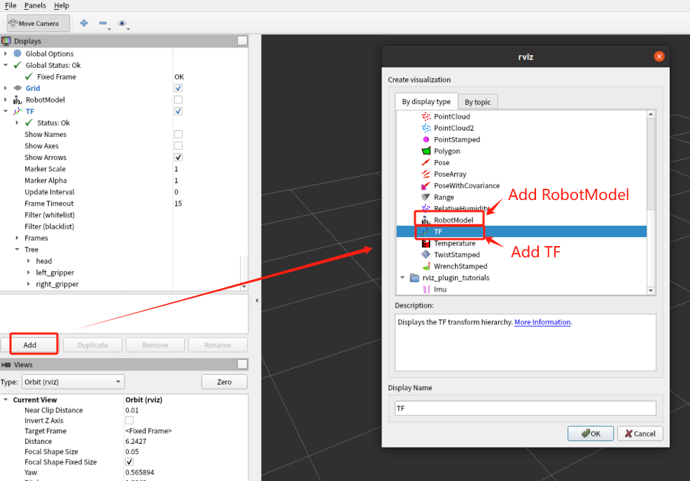
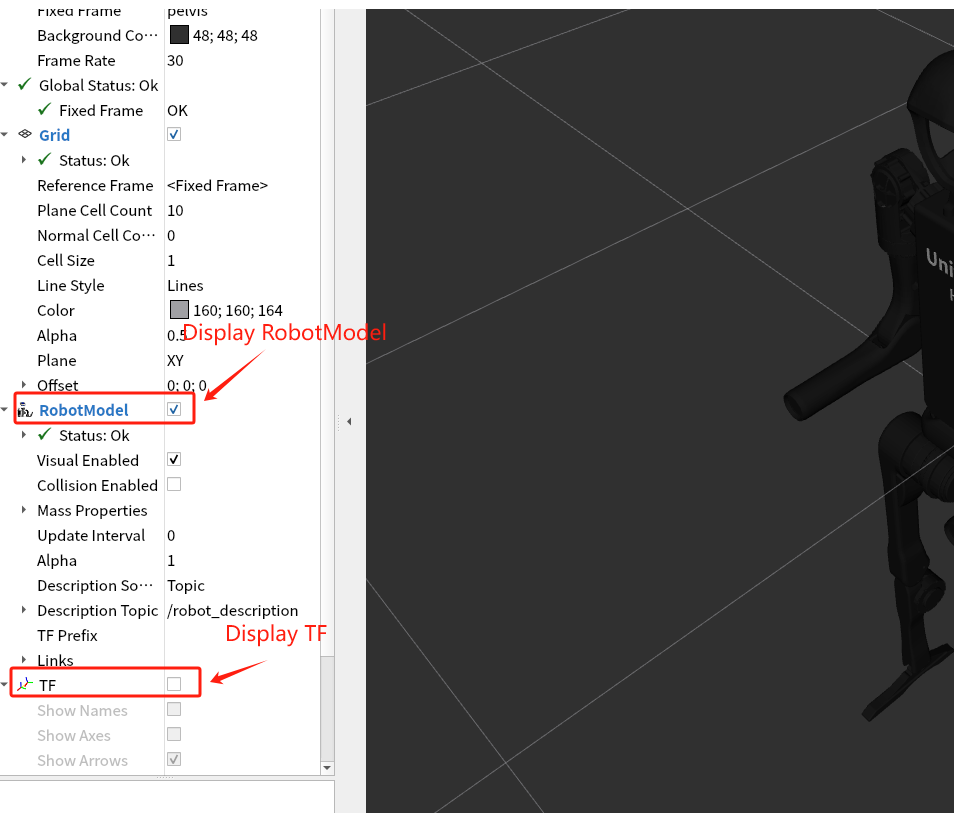

# 介绍

本工程是一个机器人仿真模拟器（RViz）节点，用来监听数据并驱动模型，目前支持宇树科技的H1机器人模型。

配合数据发布节点的工程，可以实现从Noitom公司提供的动捕软件获取数据并驱动机器人的功能。

下图展示了各个节点的数据流：


- **Noitom Mocap Software**：Noitom公司提供专业的动捕软件（如Axis Studio，Hybrid Data Server等），负责提供基于真实人体的动捕数据

  > 请联系info@noitom.com获取

- **mocap_ros_py**：基于python实现的ROS节点程序，从动捕软件获取数据，retargeting后发送给仿真器用于驱动机器人模型，或直接发送动捕数据用于驱动火柴人模型

  > 工程源码：https://github.com/pnmocap/mocap_ros_py.git

- **mocap_ros_cpp**：功能同mocap_ros_py，基于cpp实现。

  > 工程源码：https://github.com/pnmocap/mocap_ros_cpp.git

- **mocap_ros_urdf**：本工程，机器人仿真模拟器，监听来自mocap_ros_py或mocap_ros_urdf的数据，驱动机器人

  > 工程源码：https://github.com/pnmocap/mocap_ros_urdf.git

# 启动步骤

## 前提

- 一台Linux PC，已安装并配置好ROS环境（支持ROS1或ROS2）

## 说明

-  这里的ROS URDF演示模型使用的是h1.urdf（h1_with_hand.urdf暂不支持）

- RViz 中需启用 `RobotModel` 和 `TF` 插件
- 首次运行前执行 `rosdep install` 安装缺失依赖

## ROS1

1. 家目录下创建工作空间catkin_noitom

> 下列指令只需执行一次

```
mkdir -p ~/catkin_noitom/src
cd ~/catkin_noitom/src
catkin_init_workspace
cp -r unitree_h1_ros1  ~/catkin_noitom/src/
```

2. 编译并运行ROS1 RVIZ

```
cd  ~/catkin_noitom
catkin_make
source devel/setup.bash
roslaunch unitree_h1_ros1 display.launch
```

## ROS2

1. 家目录下创建工作空间catkin_noitom

> 下列指令只需执行一次

```
mkdir -p ~/catkin_noitom
cp -r unitree_h1_ros2  ~/catkin_noitom
```

2. 编译并运行ROS2 RVIZ

```
cd  ~/catkin_noitom/unitree_h1_ros2
colcon build
source install/setup.bash
ros2 launch unitree_h1_ros2 display.launch.py
```

##  配置模型（火柴人或机器人）

- 火柴人是按照真实人体的骨骼映射的一个模型，无需retargeting，可以通过bvh数据驱动。运行该模型，通常用来验证原始人体数据的正确性
- 机器人是根据URDF文件（本工程目前支持宇树科技的H1模型）的模型，数据需要经过retargeting进行驱动。

> 实际驱动时，以上两种模型二选一

### 添加模型

模拟器启动后，点击左侧"Add"按钮，在弹出的对话框里，选择RobotModel（机器人模型）或TF（火柴人模型），如下图：



### 显示模型

模拟器窗口左侧菜单栏，勾选左侧"RobotModel"复选框或”TF“复选框，即可显示机器人模型和火柴人模型，如下图：




