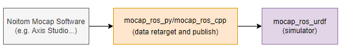

# Introducation

This project contains the URDF files of various open-source robot models. Currently, it supports the robot model of Unitree Technology's H1.

This project is a robot simulation emulator (RViz) that listens to data to drive the model.

When combined with the project of the data publishing node, it is possible to achieve the function of obtaining data from the motion capture software provided by Noitom Company and driving the robot.

The following figure shows the data flow of each component:



- **Noitom Mocap Software**: Noitom Company provides professional motion capture software (such as Axis Studio, Hybrid Data Server, etc.), which is responsible for providing motion capture data based on real human bodies.

  > please contact info@noitom.com

- **mocap_ros_py**: A ROS node program implemented in Python. It obtains data from the motion capture software, and after retargeting, sends the data to the simulator. 

  > source code: https://github.com/pnmocap/mocap_ros_py.git

- **mocap_ros_cpp**: It has the same function as mocap_ros_py, but it is implemented in C++. 

  > source code: https://github.com/pnmocap/mocap_ros_cpp.git

- **mocap_ros_urdf**: This project, a robot simulation emulator, listens to the data from mocap_ros_py or mocap_ros_urdf and drives the robot.

  > source code:  https://github.com/pnmocap/mocap_ros_urdf.git

# Launch Steps
## Prerequisites
- A Linux PC with the ROS environment installed and configured (supporting either ROS1 or ROS2).

## Instructions
- The ROS URDF demonstration model used here is h1.urdf (h1_with_hand.urdf is not supported for now).
- In RViz, the RobotModel and TF plugins need to be enabled.
- Before running for the first time, execute ```rosdep install``` to install the missing dependencies.

## ROS1

1. Create a workspace named `catkin_noitom` in the home directory.

> The following commands only need to be executed once.

```
mkdir -p ~/catkin_noitom/src
cd ~/catkin_noitom/src
catkin_init_workspace
cp -r unitree_h1_ros1  ~/catkin_noitom/src/
```

2. build and run ROS 1 RViz.

```
cd  ~/catkin_noitom
catkin_make
source devel/setup.bash
roslaunch unitree_h1_ros1 display.launch
```

## ROS2

1. Create a workspace named `catkin_noitom` in the home directory.

> The following commands only need to be executed once.

```
mkdir -p ~/catkin_noitom
cp -r unitree_h1_ros2  ~/catkin_noitom
```

2. build and run ROS2 RViz

```
cd  ~/catkin_noitom/unitree_h1_ros2
colcon build
source install/setup.bash
ros2 launch unitree_h1_ros2 display.launch.py
```

 

